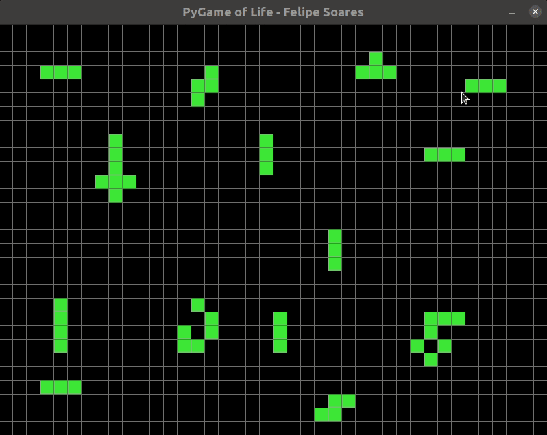
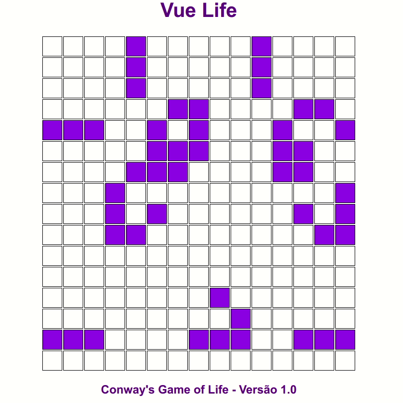

# Game of Life

Game of Life implementations with Python & Vue.js :)

The Game of Life is a cellular automaton developed by British mathematician John Horton Conway in 1970. It is the best-known example of a cellular automaton.

<details>
  <summary> Rules </summary>

### For a space that is populated

- Each cell with one or no neighbors die;
- Each cell with four or more neighbors dies;
- Each cell with two or three neighbors survives.

### For a space that is empty or unpopulated

- Each cell with three neighbors becomes populated.

</details>

## Setup guide

### Python Version

```bash

cd pylife

pip install -r requirements.txt

python life.py
```

- Select cells and click space to start or pause. <br>


Inspired by: [NeuralNine](https://www.youtube.com/watch?v=cRWg2SWuXtM)

### [Vue version](https://felipesoaresfl.github.io/game-of-life/)

```bash

cd vuelife

nvm use # if you have node version manager
npm install

# for local initialization
npm run serve
```
 <br>
Inspired by: [Tony Lâmpada](https://www.youtube.com/watch?v=Wzx1Lg035F4)
